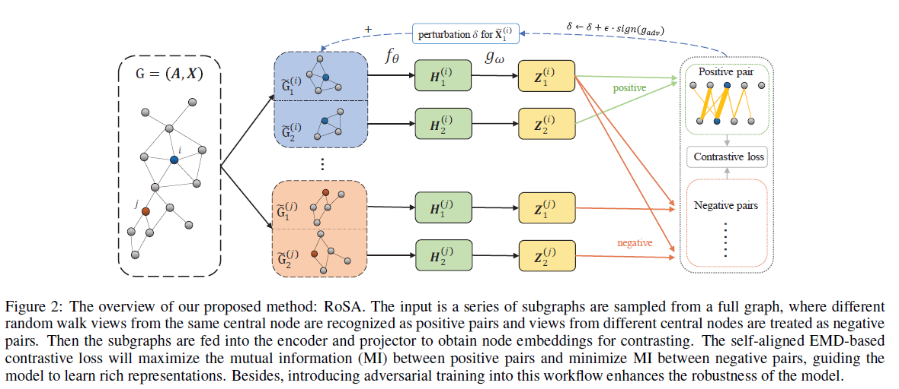

# RoSA: A Robust Self-Aligned Framework for Node-Node Graph Contrastive Learning
This repo is Pytorch implemention of <br>[RoSA: A Robust Self-Aligned Framework for Node-Node Graph Contrastive Learning](https://arxiv.org/abs/2204.13846)[\[PPT\]](https://docs.google.com/presentation/d/1RnpXrjyaojJ3Tiqu92NImtYI4cD2XVmr/edit?usp=sharing&ouid=103567337311720006952&rtpof=true&sd=true)[\[appendix\]](https://arxiv.org/abs/2204.13846) <br><br>
Yun Zhu\*, Jianhao Guo\*, Fei Wu, Siliang Tang† <br><br>
In IJCAI 2022 <br>

## Overview
This is the first work dedicated to solving non-aligned node-node graph contrastive learning problems. To tackle the non-aligned problem, we introduce a novel graph-based optimal transport algorithm, g-EMD, which does not require explicit node-node correspondence and can fully utilize graph topological and attributive information for non-aligned node-node contrasting. Moreover, to compensate for the possible information loss caused by non-aligned sub-sampling, we propose a nontrivial unsupervised graph adversarial training to improve the diversity of sub-sampling and strengthen the robustness of the model. The overview of our method is depicted as:


## Files
```
   .
    ├── dataset_apis                  # Code process datasets.
    │   ├── topology_dist              # Storing the distance of the shortest path (SPD) between vi and vj.
    │   ├── citeseer.py                # processing for citeseer dataset.
    │   ├── cora.py                    # processing for cora dataset. 
    │   ├── dblp.py                    # processing for dblp dataset.
    │   ├── pubmed.py                  # processing for pubmed dataset. 
    │   ├── cornell.py                 # processing for cornell dataset. 
    │   ├── wisconsin.py               # processing for wisconsin dataset. 
    │   ├── texas.py                   # processing for texas dataset.     
    │   └── ...                        # More datasets will be added.
    │
    ├── adversarial.py                # Code for unsupervised adversarial training.
    ├── augmentation.py               # Code for augmentation.
    ├── config.yaml                   # Configurations for our method.
    ├── eval_utils.py                 # The toolkits for evaluation.
    ├── eval.py                       # Code for evaluation.
    ├── global_var.py                 # Code for storing global variable.
    ├── model.py                      # Code for building up model.
    ├── train.py                      # Training process.
    └── ...
```

## Setup
Recommand you to set up a Python virtual environment with the required dependencies as follows:
```
conda create -n rosa python==3.9
conda activate rosa 
conda install pytorch==1.8.0 torchvision==0.9.0 torchaudio==0.8.0 cudatoolkit=11.1 -c pytorch -c conda-forge
pip install torch-scatter torch-sparse torch-cluster torch-spline-conv torch-geometric -f https://data.pyg.org/whl/torch-1.8.0+cu111.html
```
## Usage
**Command for  training model on Cora dataset**
```bash
CUDA_VISIBLE_DEVICES=0 python train.py --dataset=Cora --config=config.yaml --ad=True --rectified=True
```
For efficient usage, you can run as below:
```bash
CUDA_VISIBLE_DEVICES=0 python train.py --dataset=Cora --config=config.yaml --ad=False --rectified=False
```
Now supported datasets include Cora, Citeseer, Pubmed, DBLP, Cornell, Wisconsin, Texas. More datasets are coming soon!

**Command for  testing model on Cora dataset**<br>
After training, the best checkpoint will be stored in `checkpoints\<Dataset>\` dir. Then you can test the checkpoint through this command:
```bash
CUDA_VISIBLE_DEVICES=0 python eval.py --dataset=Cora --config=config.yaml
```

### Illustration of arguements

```
--dataset: default Cora, [Cora, Citeseer, Pubmed, DBLP, Cornell, Wisconsin, Texas] can also be choosen
--rectified: defalut False, use rectified cost matrix instead of vanilla cost matrix (if True)
--ad: default False, use unsupervised adversarial training (if True)
--aligned: default False,  use aligned views (if True)
```

### More experiments
We conduct experimetns on other five commonly used datasets with RoSA, the results show in Table 1. RoSA reaches SOTA on these datasets which proves the effectiveness of our method.
| Method | Wiki-CS | Amazon-Computers | Amazon-Photo | Coauthor-CS  | Coauthor-Physics |
| :----:| :----------: | :----------: | :----------: | :----------: | :----------: |
| DGI   | 75.35 ± 0.14 | 83.95 ± 0.47 | 91.61 ± 0.22 | 92.15 ± 0.63 | 94.51 ± 0.52 |
| GMI   | 74.85 ± 0.08 | 82.21 ± 0.31 | 90.68 ± 0.17 | OOM          | OOM          |
| MVGRL | 77.52 ± 0.08 | 87.52 ± 0.11 | 91.74 ± 0.07 | 92.11 ± 0.12 | 95.33 ± 0.03 |
| GRACE | 78.19 ± 0.01 | 87.46 ± 0.22 | 92.15 ± 0.24 | 92.93 ± 0.01 | 95.26 ± 0.02 |
| GCA   | 78.35 ± 0.05 | 88.94 ± 0.15 | 92.53 ± 0.16 | 93.10 ± 0.01 | 95.73 ± 0.03 |
| BGRL  | 79.36 ± 0.53 | 89.68 ± 0.31 | 92.87 ± 0.27 | 93.21 ± 0.18 | 95.56 ± 0.12 |
| RoSA  | **80.11 ± 0.10** | **90.12 ± 0.26** | **93.67 ± 0.07** | **93.23 ± 0.13** | **95.76 ± 0.09** |


|                  | Hidden size | Batch size | Learning rate | Walk length  | Epochs | tau | p_{e,1} | p_{e,1} | p_{f,1} | p_{f,1} |
| :----            | :---------- | :--------- | :------------ | :----------- | :----- | :-- | :-------- | :-------- | :-------- | :-------- |
| Wiki-CS          | 256         | 256        | 1e-3          | 10           | 500    | 0.5 | 0.2       | 0.3       | 0.2       | 0.3       |
| Amazon-Computers | 128         | 256        | 1e-3          | 10           | 500    | 0.2 | 0.4       | 0.5       | 0.1       | 0.2       |
| Amazon-Photo     | 256         | 256        | 1e-3          | 10           | 500    | 0.3 | 0.2       | 0.3       | 0.2       | 0.3       |
| Coauthor-CS      | 256         | 128        | 1e-3          | 10           | 100    | 0.1 | 0.2       | 0.3       | 0.2       | 0.3       |
| Coauthor-Physics | 128         | 256        | 1e-3          | 10           | 100    | 0.5 | 0.2       | 0.3       | 0.2       | 0.3       |

In additions, we use `prelu` as activation function and use `adamw` optimizer with `5e-4 weight decay` for all experimetns. The restart ratio of random walking is 0.5.

## Citation
If you use this code for you research, please cite our paper. 
```
@inproceedings{ijcai2022-527,
  title     = {RoSA: A Robust Self-Aligned Framework for Node-Node Graph Contrastive Learning},
  author    = {Zhu, Yun and Guo, Jianhao and Wu, Fei and Tang, Siliang},
  booktitle = {Proceedings of the Thirty-First International Joint Conference on
               Artificial Intelligence, {IJCAI-22}},
  publisher = {International Joint Conferences on Artificial Intelligence Organization},
  editor    = {Lud De Raedt},
  pages     = {3795--3801},
  year      = {2022},
  month     = {7},
  note      = {Main Track}
  doi       = {10.24963/ijcai.2022/527},
  url       = {https://doi.org/10.24963/ijcai.2022/527},
}
```
